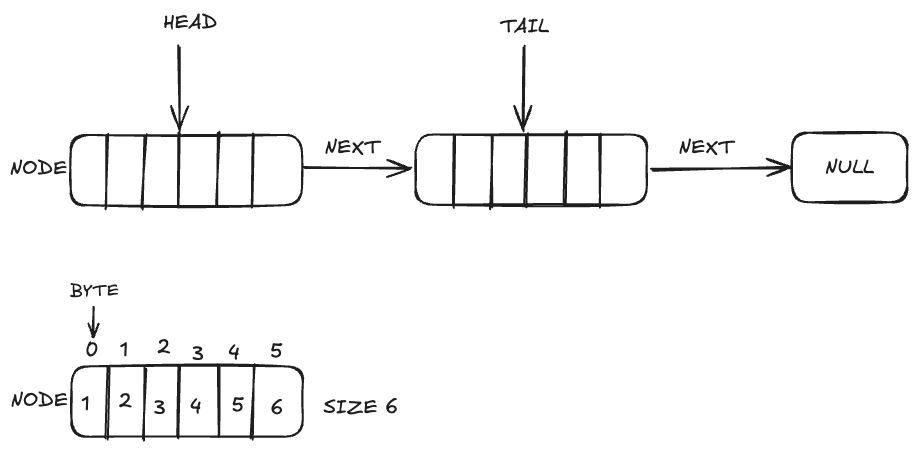

## Analysis

### _Which program is fastest? Is it always the fastest?_

Generally `malloc` seemed to run the fastest, though `alloca` was really close to it every time. The difference in speed between all the programs seemed to vanish when the `OPT -O2 -g2` was used in conjunction with large data size.
    
> Example of malloc being faster in a run

|IMPL TYPE|OPT|MIN_BYTES|MAX_BYTES|NUM_BLOCKS|MIN_TIME|AVG_TIME|MAX_TIME|
|---|---|---|---|---|---|---|---|
|malloc|-g|10|1000|1000000|2.49|2.53|2.77|
|alloca|-g|10|1000|1000000|2.65|2.66|2.71|

> Example of the difference vanishing when optimization used with large `MAX_BYTES`

|IMPL TYPE|OPT|MIN_BYTES|MAX_BYTES|NUM_BLOCKS|MIN_TIME|AVG_TIME|MAX_TIME|
|---|---|---|---|---|---|---|---|
|alloca|-O2 -g2|10|10000|1000000|8.67|8.79|9.04|
|list|-O2 -g2|10|10000|1000000|8.65|8.78|8.98|
|malloc|-O2 -g2|10|10000|1000000|8.46|8.55|8.7|
|new|-O2 -g2|10|10000|1000000|8.47|8.6|8.87|

---

### _Which program is slowest? Is it always the slowest?_
`new` was the slowest program in every run, while optimizing it did reduce the difference with larger payloads, in general without optimization `new` was the slowest quickly followed by `list`.
> example data

|IMPL TYPE|OPT|MIN_BYTES|MAX_BYTES|NUM_BLOCKS|MIN_TIME|AVG_TIME|MAX_TIME|
|---|---|---|---|---|---|---|---|
|alloca|-g|10|1000|100000|0.26|0.269|0.27|
|list|-g|10|1000|100000|0.92|0.93|0.96|
|malloc|-g|10|1000|100000|0.24|0.25|0.27|
|new|-g|10|1000|100000|0.93|0.938|0.99|

---

### Was there a trend in program execution time based on the size of data in each `Node`? If so, what, and why?
The larger the size of data the longer the program takes to execute, this can be seen in the following data:

|IMPL TYPE|OPT|MIN_BYTES|MAX_BYTES|NUM_BLOCKS|MIN_TIME|AVG_TIME|MAX_TIME|
|---|---|---|---|---|---|---|---|
|alloca|-g|4|10|1000000|0.19|0.2|0.24|
|alloca|-g|10|1000|1000000|2.65|2.66|2.71|
|alloca|-g|100|1000|1000000|3.09|3.11|3.16|
|alloca|-g|10|10000|1000000|24.09|24.32|24.87|

I have two guesses as to why this happens. One, the larger data chunk takes longer to allocate and that increases the runtime or, Two, the bigger data chunks are harder to hash. I am leaning towards the second idea as the system time did not seemed to be moving much, but I did not record that data so I cannot be certain. 

---

### Was there a trend in program execution time based on the length of the block chain?

Yes, the longer the block chain the longer the program took to execute, this relation seems linear to me as can be seen in the following data:

|IMPL TYPE|OPT|MIN_BYTES|MAX_BYTES|NUM_BLOCKS|MIN_TIME|AVG_TIME|MAX_TIME|
|---|---|---|---|---|---|---|---|
|alloca|-g|10|1000|10000|0.02|0.028|0.03|
|alloca|-g|10|1000|100000|0.26|0.269|0.27|
|alloca|-g|10|1000|1000000|2.65|2.66|2.71|

> each 10x increase in the block chain size seems to increase the run time by roughly a magnitude of 10 as well

### Consider heap breaks, what's noticeable? Does increasing the stack size affect the heap? Speculate on any similarities and differences in programs?
Heap breaks are constant for `alloca` at 69 whereas for the other programs the heap breaks scale with `NUM_BLOCKS`. Because alloca is allocating memory on the stack instead of the heap, we do not see an increase in heap breaks in `alloca`, this means that stack size would also not impact the heap.

|Breaks at NUM_BLOCKS|1000000|10000000|
|---|---|---|
|alloca|69|69|
|list|37179|371081|
|malloc|36996|369268|
|new|37182|371079|

---

### Considering either the **malloc.cpp** or **alloca.cpp** versions of the program, generate a diagram showing two `Node`s. Include in the diagram, the relationship of the `head`, `tail`, and `Node` `next` pointers. ; Show the size (in bytes) and structure of a `Node` that allocated six bytes of data; Include the `bytes` pointer, and indicate using an arrow which byte in the allocated memory it points to.

---

### There's an overhead to allocating memory, initializing it, and eventually processing (in our case, hashing it). For each program, were any of these tasks the same? Which one(s) were different?

For each program initializing and processing the memory into the was the same process. We know hashing is the same because we are returned the same hash in the `test` program. The only thing that differed was how that memory was being allocated. For `malloc` and `new` memory is being allocated on the heap, whereas the memory for `list` is being stored in a `std::vector` which is also stored on the heap and lastly `alloca` allocates memory on the stack.

---

### As the size of data in a `Node` increases, does the significance of allocating the node increase or decrease?
I believe that the significance of allocating a node increases as the size of the data in a node increases. This can be seen in the increase in the system time when I increased the `MAX_BYTES` from `MAX_BYTES=100000` to`MAX_BYTES=1000000`, in case of `alloca` the system time jumped from around 0.24s to 2.39s.  Similar spikes were seen in other programs as well. This makes sense because we are trying to allocate a larger blob of memory which can be harder to find for the system. 

---

## Data Collected

|IMPL TYPE|OPT|MIN_BYTES|MAX_BYTES|NUM_BLOCKS|MIN_TIME|AVG_TIME|MAX_TIME|MEMORY ~(KB)|PAGE ALLOCATIONS|
|---|---|---|---|---|---|---|---|---|---|
|alloca|-g|10|10000|1000000|24.09|24.32|24.87|5040000|69|
|list|-g|10|10000|1000000|88.82|89.93|91.56|4957000|37179|
|malloc|-g|10|10000|1000000|23.66|23.81|24.06|4934000|36996|
|new|-g|10|10000|1000000|90.02|91.11|92.81|4958000|37182|
|alloca|-O2 -g2|10|10000|1000000|8.67|8.79|9.04|4935000|69|
|list|-O2 -g2|10|10000|1000000|8.65|8.78|8.98|4958000|37179|
|malloc|-O2 -g2|10|10000|1000000|8.46|8.55|8.7|4934000|36996|
|new|-O2 -g2|10|10000|1000000|8.47|8.6|8.87|4958000|37182|
|alloca|-O3 -g2|10|10000|1000000|7.92|8.06|8.35|4934000|69|
|list|-O3 -g2|10|10000|1000000|7.94|8.05|8.14|4957000|37179|
|malloc|-O3 -g2|10|10000|1000000|7.6|7.72|7.97|4934000|36996|
|new|-O3 -g2|10|10000|1000000|7.83|8.03|8.49|4957000|37182|
|alloca|-O2 -g2|10|10000|10000000|88.91|89.44|89.89|49305000|69|
|list|-O2 -g2|10|10000|10000000|88.68|93.32|102.62|49540000|371081|
|malloc|-O2 -g2|10|10000|10000000|85.5|85.87|86.24|49305000|369268|
|new|-O2 -g2|10|10000|10000000|86.14|86.52|87.2|49540000|371079|
|alloca|-g|10|1000|10000|0.02|0.028|0.03|9800||
|list|-g|10|1000|10000|0.09|0.098|0.1|9300||
|malloc|-g|10|1000|10000|0.02|0.029|0.03|8600||
|new|-g|10|1000|10000|0.09|0.098|0.1|9200||
|alloca|-g|10|1000|100000|0.26|0.269|0.27|68000||
|list|-g|10|1000|100000|0.92|0.93|0.96|59000||
|malloc|-g|10|1000|100000|0.24|0.25|0.27|57000||
|new|-g|10|1000|100000|0.93|0.938|0.99|59000||
|alloca|-g|10|1000|1000000|2.65|2.66|2.71|649000||
|list|-g|10|1000|1000000|9.3|9.45|9.97|562000||
|malloc|-g|10|1000|1000000|2.49|2.53|2.77|539000||
|new|-g|10|1000|1000000|9.28|9.44|9.92|562000||
|alloca|-g|100|1000|1000000|3.09|3.11|3.16|736000||
|list|-g|100|1000|1000000|10.87|10.93|11.08|650000||
|malloc|-g|100|1000|1000000|2.91|3.147|3.4|626000||
|new|-g|100|1000|1000000|10.87|11.09|11.54|650000||
|alloca|-g|4|10|1000000|0.19|0.2|0.24|159000||
|list|-g|4|10|1000000|0.52|0.53|0.55|81000||
|malloc|-g|4|10|1000000|0.12|0.127|0.13|50000||
|new|-g|4|10|1000000|0.41|0.41|0.44|81000||