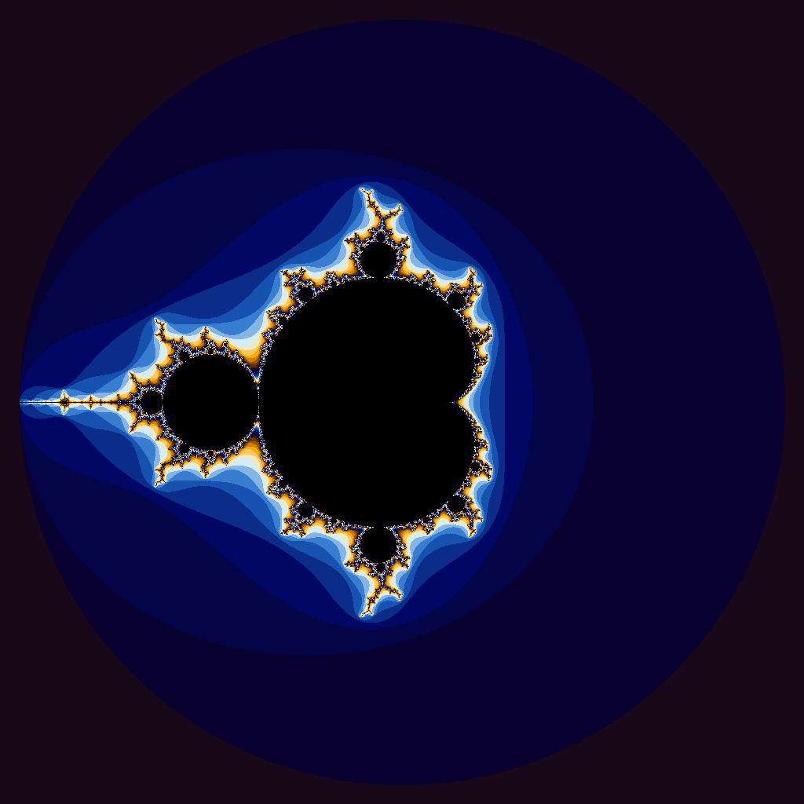

**Question:** Are the results what you expected? Speculate as to why it looks like CUDA isn’t a great solution for this problem.

__Results for IOTA.cpu__

| Vector Length | Wall Clock Time | User Time | System Time |
| :--------------: | -----------------: | --------: | ----------: |
|        10        |               0.00 |      0.00 |        0.00 |
|       100        |               0.00 |      0.00 |        0.00 |
|       1000       |               0.00 |      0.00 |        0.00 |
|      10000       |               0.00 |      0.00 |        0.00 |
|      100000      |               0.00 |      0.00 |        0.00 |
|     1000000      |               0.00 |      0.00 |        0.00 |
|     5000000      |               0.02 |      0.00 |        0.02 |
|    100000000     |               0.56 |      0.10 |        0.45 |
|    500000000     |               2.80 |      0.46 |        2.34 |
|    1000000000    |               5.68 |      0.92 |        4.76 |
|    5000000000    |              33.47 |      5.57 |       27.89 |

__Results for IOTA.gpu__

| Vector Length | Wall Clock Time | User Time | System Time |
| :--------------: | -----------------: | --------: | ----------: |
|        10        |               0.37 |      0.01 |        0.33 |
|       100        |               0.25 |      0.01 |        0.22 |
|       1000       |               0.25 |      0.01 |        0.22 |
|      10000       |               0.25 |      0.01 |        0.22 |
|      100000      |               0.26 |      0.01 |        0.23 |
|     1000000      |               0.27 |      0.01 |        0.23 |
|     5000000      |               0.27 |      0.01 |        0.24 |
|    100000000     |               0.90 |      0.18 |        0.69 |
|    500000000     |               3.50 |      0.77 |        2.71 |
|    1000000000    |               7.10 |      1.96 |        5.11 |
|    5000000000    |              44.16 |     10.76 |       33.41 |

Looking at these two we can see that the CPU is about 1.3x faster (roughly 25–30%). I did not expect this to be the case. I assumed this because I thought that the workload would be way more divided and easier for CUDA, but now that I think about it, I believe the work that was divided among all the threads may not have been enough to warrant doing it in CUDA, as we are just adding two numbers together. I believe that the bulk of the time being taken is not the computation, rather it is the time it takes to transfer all the data back from the GPU to the CPU over PCIe. When a CPU does this it has rapid access to all the memory, but going through PCIe to the GPU and back is much slower, so the bulk of the time must be the setup and transfer process for CUDA, like allocating GPU memory and copying the results back.

*Julia set with starting $z = 0.420 + 0.670i$*
